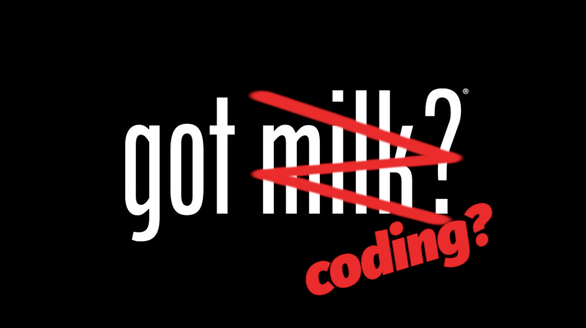
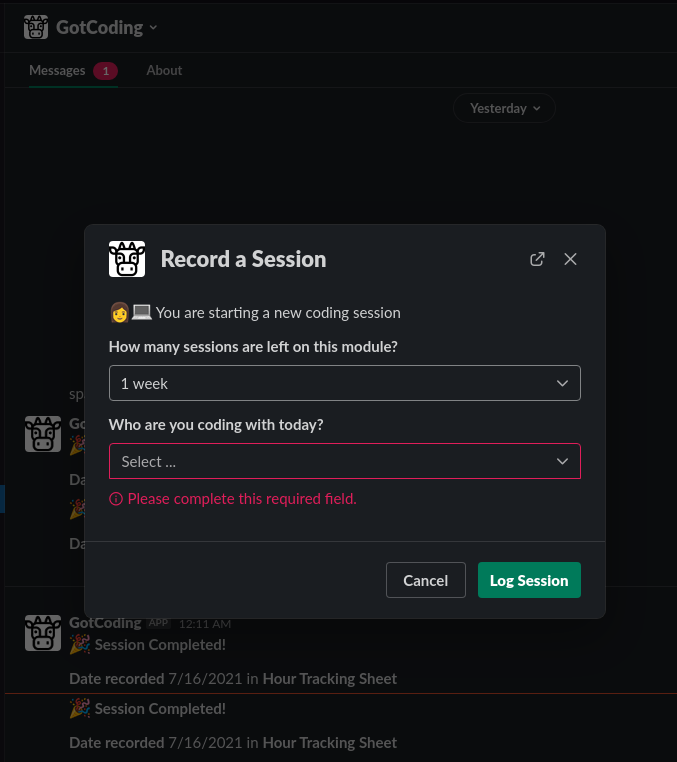

# GotCoding?

[Have you Got Coding?](https://getcoding.ca)



## Usage

DM the bot, or use it in a channel with the message `/start`. It will send a message back asking to pick a student. It logs the day you picked that student, along with your name. Pretty simple, but this opens the door for more automation in the future



### 1. Setup environment variables

```zsh
AWS_ACCESS_KEY_ID=
AWS_SECRET_ACCESS_KEY=
SLACK_BOT_TOKEN=
SLACK_SIGNING_SECRET=
GOOGLE_SHEET_ID=
GOOGLE_CREDS_FILE=
```

### 2. Setup your local project

```zsh
# Install the dependencies
npm install
```

### 3. Start servers

[Setup ngrok](https://ngrok.com/) to create a local requests URL for development.

```zsh
npm run ngrok
npm run start
```

[Follow this tutorial for deploying on AWS](https://slack.dev/bolt-js/deployments/aws-lambda)

[Follow this tutorial for setting up a Google Sheet](https://developers.google.com/sheets/api/quickstart/nodejs)
